<div style="text-align: center;">

# 🎵 Fivefy

### AI 기반 음악 구독 스트리밍 플랫폼

YouTube Music을 벤치마킹한 **AI 개인화 추천 · 자연어 검색 · 주간 인기 차트 · 안전한 정기 결제** 플랫폼

<br>


<br>

| 🎯 목표 규모 | 📊 재생 기록 | ⚡ 목표 처리량 | ⏱️ 목표 응답 | 📅 개발 기간 |
|:---:|:---:|:---:|:---:|:---:|
| **트랙 1억 건** | **월 3,000만 건** | **RPS 1,000** | **P95 200ms** | **6주** |

</div>

---

## 📌 목차

- [프로젝트 소개](#-프로젝트-소개)
- [팀원 소개](#-팀원-소개)
- [기술 스택](#-기술-스택)
- [아키텍처](#-아키텍처)
- [주요 기능](#-주요-기능)
- [ERD](#-erd)
- [API 문서](#-api-문서)
- [시작하기](#-시작하기)
- [브랜치 전략](#-브랜치-전략)
- [커밋 컨벤션](#-커밋-컨벤션)
- [트러블슈팅 · 기술 의사결정](#-트러블슈팅--기술-의사결정)

---

## 🎯 프로젝트 소개

> **Fivefy** 는 사용자의 취향과 상황에 맞는 음악 경험을 제공하는  
> **AI 기반 음악 구독 스트리밍 플랫폼**입니다.

단순한 음악 재생을 넘어 **AI 개인화 추천**, **자연어 무드 검색**, **주간 인기 차트**, **플레이리스트 관리**, **구독·포인트 결제**, **알림 시스템**을 제공합니다.

---

### 💎 핵심 포인트

<table>
<tr>
<td style="width: 20%; text-align: center; vertical-align: middle;">🤖<br><b>AI 개인화</b></td>
<td>Spring AI 2.0.0-M2 위에 <b>Ollama 임베딩</b> + <b>Anthropic Claude</b> 조합으로 자연어 검색·취향 추천·이유 설명 생성. Resilience4j 로 LLM 안정성 확보</td>
</tr>
<tr>
<td style="text-align: center; vertical-align: middle;">📊<br><b>실시간 인기 차트</b></td>
<td>유효 재생 기준 (<b>30초 이상 + 종료 상태 + 세션 중복 제거</b>) 주간 Top100 Snapshot. 매 요청 단순 read</td>
</tr>
<tr>
<td style="text-align: center; vertical-align: middle;">🎧<br><b>상태 기반 재생</b></td>
<td>행동이 아닌 <b>상태 전이</b>로 표현하는 끊김 없는 재생 흐름. <code>sessionId + playlistId</code> 로 연속성 보장</td>
</tr>
<tr>
<td style="text-align: center; vertical-align: middle;">🔔<br><b>이중 알림 파이프라인</b></td>
<td>단건은 <b>Outbox 패턴</b> (유실 방지), 대량은 <b>RabbitMQ fan-out</b> (처리량 확보). 핵심 가치 기준 분리</td>
</tr>
<tr>
<td style="text-align: center; vertical-align: middle;">💳<br><b>안전한 정기 결제</b></td>
<td>PortOne V2 빌링키 + Redisson 분산락 기반 중복 결제 차단. 매월 1일 자동 결제 스케줄</td>
</tr>
<tr>
<td style="text-align: center; vertical-align: middle;">🛡️<br><b>운영 가능한 무결성</b></td>
<td>Application 다층 방어선 — <b>PESSIMISTIC_WRITE → Generated UNIQUE → app_id UNIQUE</b> 3단</td>
</tr>
<tr>
<td style="text-align: center; vertical-align: middle;">⚡<br><b>조회 성능과 캐시 안정성</b></td>
<td>Page → Slice 전환, 댓글 복합 인덱스, Redis 장애 시 DB 조회 fallback으로 read API 성능과 장애 격리 검증</td>
</tr>
</table>

---

## 👥 팀원 소개

| 이름 | 역할 | 주요 기여 | GitHub |
|---|---|---|---|
| 곽현민 | 🔐 인증, 인프라 | JWT/OAuth2 인증, 회원 탈퇴 2단계 처리, CI/CD | [@prAha1030](https://github.com/prAha1030) |
| 나은총 | 🎵 음악 콘텐츠 | Artist/Album/Track, 검색 성능 개선, Redis 캐싱 | [@popo2381](https://github.com/popo2381) |
| 유지현 | 🔔 알림, 소셜 | 알림 시스템, Follow/Like, Outbox, RabbitMQ | [@jihyeon1346](https://github.com/jihyeon1346) |
| 방효경 | 🎧 재생·플레이리스트·차트 | Playback 상태 전이 설계, PlaylistTrack 성능 개선, PopularChart Snapshot | [@Banhklo2](https://github.com/Banhklo2) |
| 이준석 | 💳 구독, 결제 | PortOne V2 결제, 포인트/지갑, 정기결제 스케줄러 | [@Perfect-Bee](https://github.com/Perfect-Bee) |

---

## 🛠️ 기술 스택

### Backend


### Database & Cache


### Message Queue


### AI / Resilience


### Infra & DevOps


### Payment


### Docs & Test


---

## 🏗️ 아키텍처

### 🌐 System Architecture

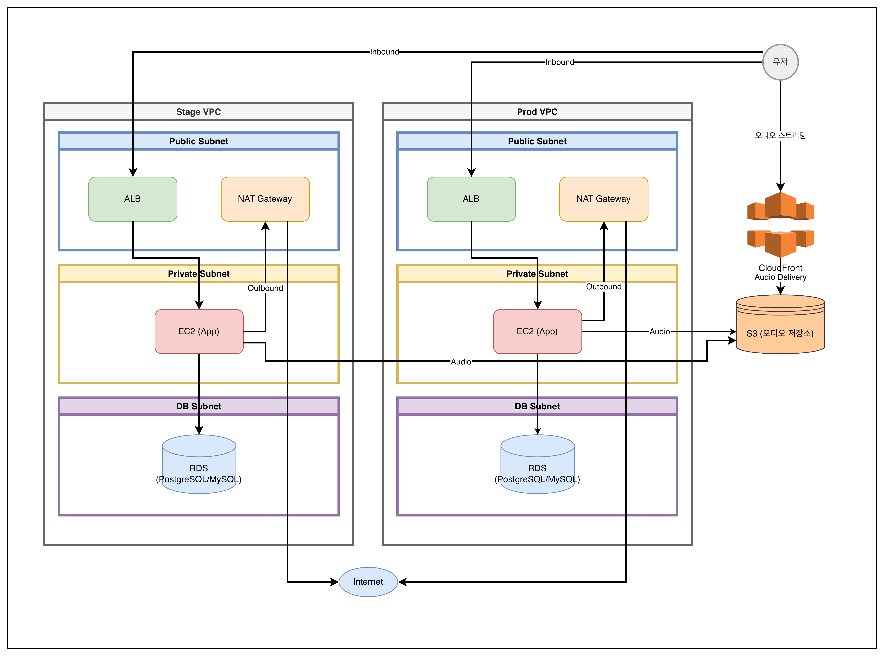

### 📦 Modular Monolith

> `com.fivefy.{ai, common, domain}` 3계층 · 도메인 **21개 모듈** 응집

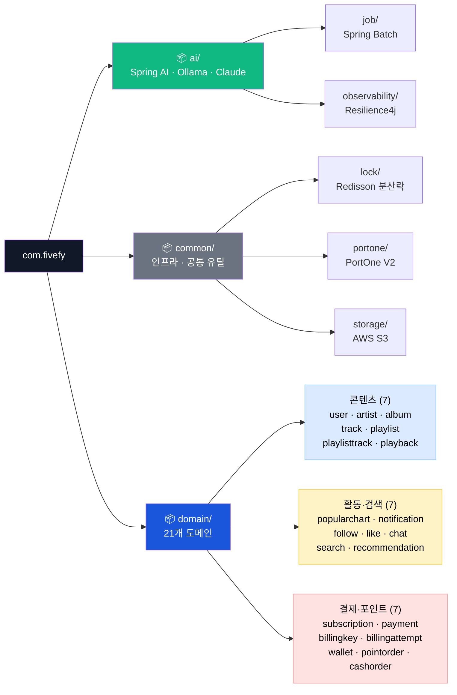

### 🔄 Key Request Flows

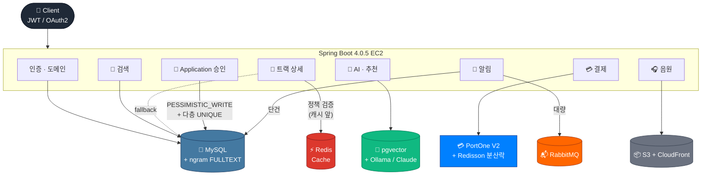

### 📊 도메인 분포

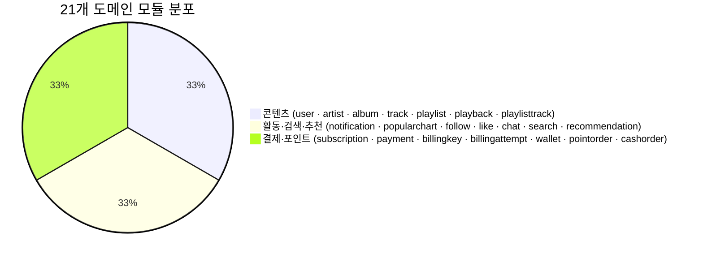

---

## ✨ 주요 기능

### 🔐 인증 · 회원

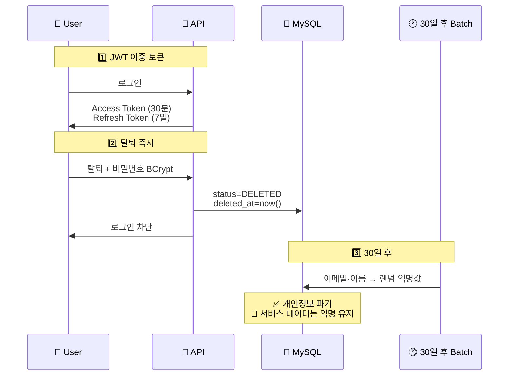

| 기능 | 상세 |
|---|---|
| **JWT 이중 토큰** | Access 30분 + Refresh 7일 (Stateless · 수평 확장 대응) |
| **회원 탈퇴 2단계** | 즉시 차단 → 30일 후 익명화 배치 (개인정보 보호법 + 서비스 데이터 보존 균형) |
| **비밀번호 BCrypt 재확인** | 탈퇴 시 토큰 탈취 공격 차단 |

### 🎵 스트리밍 · Playback 상태 전이

> 행동 중심 enum (`START / PAUSE / SKIP`) → **상태 중심 enum** 재설계
> *"Playback 한 건이 무엇을 의미하는가" 부터 재정의*

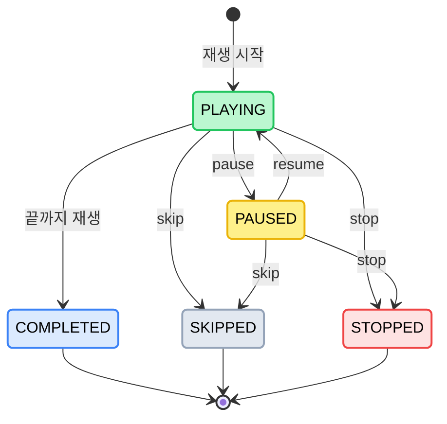

| 항목 | 내용 |
|---|---|
| **시간 필드 분리** | `startedAt` / `lastPlayedAt` / `endedAt` — 실제 재생만 누적 (PAUSED 시간 제외) |
| **연속 재생 세션** | `sessionId` + `playlistId` 로 끊김 없는 재생 흐름 표현 |
| **음원 배포** | AWS S3 Presigned URL + CloudFront (`audioKey` 기반) |

### 🎙️ Application 다층 방어선

> 한 가지 잠금으로 끝나지 않는 동시성 문제 — **3단 방어선** 으로 완성

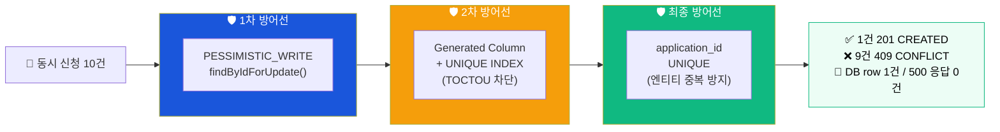

| 방어선 | 적용 위치 | 역할 |
|:---:|---|---|
| 🛡️ **1차** | 승인/거절 경로 `findByIdForUpdate()` | **승인 동시성** — 같은 row 두 번 처리 차단 |
| 🛡️ **2차** | Generated Column + UNIQUE | **신청 중복 (TOCTOU)** — `saveAndFlush` 로 즉시 충돌 감지 |
| 🛡️ **최종** | `application_id` UNIQUE | **엔티티 중복 생성** — DB 최종 방어 |

## 📊 PopularChart 주간 Top100

실시간 집계가 아닌 **주간 Snapshot 구조**로 인기 차트를 설계했습니다.

| 설계 포인트 | 설명 |
|---|---|
| 집계 기준 | `playedDuration >= 30초` |
| 종료 상태 | `STOPPED / SKIPPED / COMPLETED` 만 포함 |
| 중복 제거 | `(sessionId, trackId)` 기준 중복 재생 제거 |
| 집계 주기 | 매주 월요일 기준 주간 Top100 생성 |
| 조회 방식 | 미리 생성된 Snapshot 단순 조회 |
| 최적화 | Projection + DB LIMIT 적용 |

---

### 🔔 알림 시스템의 진화

> **정합성 → 유실 방지 → 처리량** 으로 3단계 진화

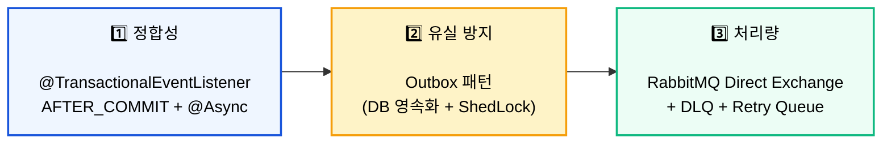

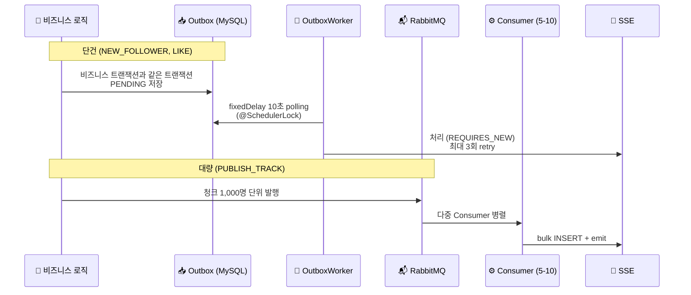

| 단계 | 처리 방식 | 핵심 가치 |
|:---:|---|:---:|
| **1️⃣** | `AFTER_COMMIT + @Async` | 🎯 **정합성** |
| **2️⃣** | Outbox 패턴 (DB 영속화) | 🛡️ **유실 방지** |
| **3️⃣** | RabbitMQ fan-out | ⚡ **처리량** |

**통신 분리**: 알림은 단방향 **SSE** / 채팅은 양방향 **WebSocket**

### 💳 포인트 · 결제

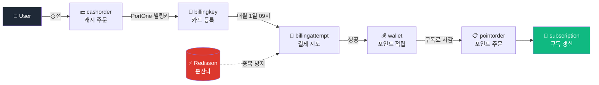

| 도메인 분할 | 책임 |
|---|---|
| `billingkey` | 카드 등록 / 빌링키 발급·해지 |
| `billingattempt` | 정기결제 시도 / 재시도 / 실패 처리 |
| `cashorder` | 캐시(현금) 충전 주문 |
| `pointorder` | 포인트 사용 주문 |
| `wallet` | 사용자 지갑 (포인트 잔액) |
| `subscription` | 구독 플랜·상태 |

**스케줄러**: 매월 1일 **08시 충전** / **09시 정기결제** (ShedLock 다중 인스턴스 락)

### 🎧 플레이리스트

| 기능                        | 상세                                                     |
|---------------------------|--------------------------------------------------------|
| **Soft delete + cleanup** | 30일 cleanup scheduler (ShedLock)                       |
| **활성 데이터 기준 unique**      | `(user_id, title, deleted)` 복합 unique — 활성끼리만 제목 중복 금지 |
| **부분 재정렬**                | 영향 범위만 update + 임시 음수 position 으로 unique 충돌 회피         |

### 🔎 검색

```sql
ALTER TABLE artists ADD FULLTEXT INDEX ft_artist_name (name) WITH PARSER ngram;
ALTER TABLE tracks  ADD FULLTEXT INDEX ft_track_title (title) WITH PARSER ngram;
ALTER TABLE albums  ADD FULLTEXT INDEX ft_album_title (title) WITH PARSER ngram;
```

- **MySQL ngram FULLTEXT (2-gram)** — `LIKE '%키워드%'` 풀스캔 회피
- `홍길동` → `"홍길"` + `"길동"` 2-gram 분해 → B-Tree 인덱스 적중
- Hibernate 7 QueryDSL 의 `MATCH AGAINST` 미지원 우회 — EntityManager 네이티브 쿼리

### 🤖 AI 추천

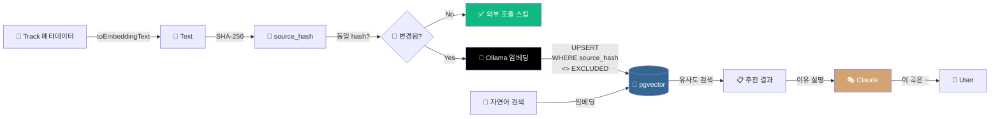

| 기능 | 핵심 |
|---|---|
| **재생 이력 기반 추천** | Spring AI |
| **자연어 검색** | 사용자 입력 → 임베딩 → pgvector 유사도 검색 |
| **추천 이유 설명 생성** | Anthropic Claude (Resilience4j Circuit Breaker) |
| **임베딩 멱등성** | `source_hash` (SHA-256) 변경 감지 → **외부 API 호출 감소** |
 
---

## 📐 ERD


<details>
<summary>테이블 목록 보기</summary>

| 카테고리 | 테이블 | 설명 |
|---|---|---|
| **유저** | `users` | 회원 정보 (soft delete + 익명화) |
| **아티스트** | `artists` / `artist_applications` | 아티스트 프로필 / 등록 신청 흐름 |
| **앨범** | `albums` / `album_applications` | 앨범 정보 / 등록 신청 흐름 |
| **트랙** | `tracks` / `track_applications` | 트랙 정보 / 등록 신청 흐름 (FREE_CREATION / OFFICIAL_RELEASE) |
| **검색** | (FULLTEXT INDEX) | `ft_artist_name`, `ft_track_title`, `ft_album_title` (ngram) |
| **재생** | `playbacks` | 상태 전이 재생 이벤트 (sessionId + playlistId) |
| **인기차트** | `popular_chart_snapshots` | 주간 Top100 |
| **플레이리스트** | `playlists` / `playlist_tracks` | 유저 플레이리스트 (소프트 삭제, 부분 재정렬) |
| **좋아요** | `likes` | 다형성 좋아요 (`targetId + targetType`) |
| **댓글** | `track_comments` | 트랙 댓글 (`(track_id, deleted_at, created_at DESC)` 복합 인덱스) |
| **팔로우** | `follows` | 아티스트 팔로우 |
| **알림** | `notifications` / `notification_outbox` | 알림 / Outbox 패턴 영속화 |
| **임베딩** | `track_embedding` | pgvector 임베딩 + `source_hash` + `model_version` |
| **구독** | `subscriptions` | 구독 플랜 및 상태 |
| **결제** | `payments` / `billing_keys` / `billing_attempts` | 결제 / 빌링키 / 시도 이력 |
| **포인트** | `wallets` / `point_orders` / `cash_orders` | 지갑 / 포인트 주문 / 캐시 충전 주문 |
| **검색** | `search_histories` | 유저 검색 이력 |
| **추천** | `recommendations` | AI 추천 결과 |
| **채팅** | `chats` | AI 챗봇 답변 스트리밍 (SSE) |

</details>

---

## 📕 API 문서

Spring REST Docs 기반으로 API 문서를 생성합니다.

```bash
./gradlew asciidoctor      # 문서 생성
open build/docs/asciidoc/index.html
```

bootJar 빌드 시 `static/docs` 로 패키징되어 `/docs/index.html` 에 자동 노출됩니다.
 
---

## 🚀 시작하기

### 📋 사전 요구사항

| 도구 | 버전 |
|---|---|
| ☕ **JDK** | 21 (CI 빌드 기준, 소스 toolchain 은 Java 17) |
| 🐳 **Docker & Docker Compose** | 최신 |
| 🐬 **MySQL** | 8.4 |
| 🐘 **PostgreSQL** | 16 (벡터 DB) |
| 🐰 **RabbitMQ** | 3 |

### ⚙️ 환경 설정

```bash
# 1. 레포지토리 클론
git clone https://github.com/fivefy/fivefy.git
cd fivefy

# 2. 환경변수 설정
touch .env
touch application-local.yml
# .env, application-local.yml 파일에 실제 값 입력

# 3. 인프라 컨테이너 실행 (RabbitMQ + Redis)
docker compose up -d

# 4. DB 초기화 (Flyway 가 마이그레이션 자동 적용)
#    필요 시 seed 데이터:
#    smoke / test / local / dev scale 분리되어 있음

# 5. 애플리케이션 실행
./gradlew bootRun --args='--spring.profiles.active=local'
```

### 🔌 실행 포트

<table>
<tr>
<th style="text-align: center; vertical-align: middle;">서비스</th>
<th style="text-align: center; vertical-align: middle;">포트</th>
<th style="text-align: center; vertical-align: middle;">서비스</th>
<th style="text-align: center; vertical-align: middle;">포트</th>
</tr>
<tr>
<td>🌱 Spring Boot</td><td style="text-align: center; vertical-align: middle;"><code>8080</code></td>
<td>🐰 RabbitMQ</td><td style="text-align: center; vertical-align: middle;"><code>5672</code></td>
</tr>
<tr>
<td>🐰 RabbitMQ Management</td><td style="text-align: center; vertical-align: middle;"><code>15672</code></td>
<td>⚡ Redis</td><td style="text-align: center; vertical-align: middle;"><code>6379</code></td>
</tr>
<tr>
<td>🔍 RedisInsight</td><td style="text-align: center; vertical-align: middle;"><code>5540</code></td>
<td>🐬 MySQL</td><td style="text-align: center; vertical-align: middle;"><code>3306</code></td>
</tr>
<tr>
<td>🐘 PostgreSQL (vector)</td><td style="text-align: center; vertical-align: middle;"><code>5432</code></td>
<td></td><td></td>
</tr>
</table>
 
---

## 🌿 브랜치 전략

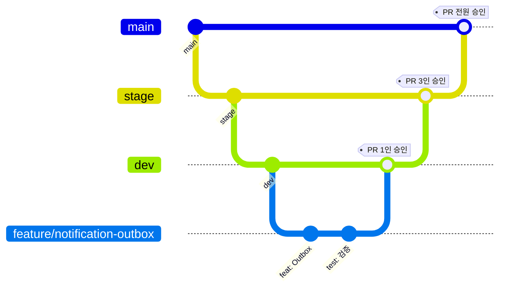

| 브랜치 | 용도 | PR 승인 요건 |
|:---:|---|:---:|
| 🚀 `main` | 프로덕션 배포 | **전원 승인** |
| 🧪 `stage` | 스테이징 배포 | **3인 이상** |
| 🛠️ `dev` | 개발 통합 | **1인 이상 + CI 통과** |
| 🌱 `feature/{도메인}-{기능명}` | 기능 개발 | — |

### 🔄 CI / CD 파이프라인

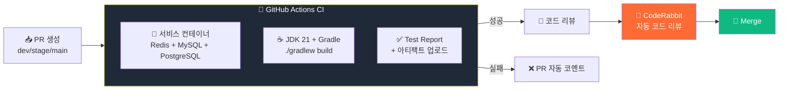

- **`.github/workflows/ci.yml`** — PR → `dev/stage/main` 트리거, 서비스 컨테이너 (Redis 7.4 + MySQL 8.4 + PostgreSQL 16)
- **`.github/workflows/cd.yml`** — 배포 자동화
- **`.coderabbit.yml`** — 자동 코드 리뷰 (다층 방어선 · 인덱스 정책의 출발점)

---

## ✏️ 커밋 컨벤션

```
<타입>: <제목>

[본문 — 선택]
```

|     타입     | 설명           |
|:----------:|--------------|
|   `feat`   | 새로운 기능 추가    |
|   `fix`    | 버그 수정        |
|   `docs`   | 문서 수정        |
|   `init`   | 초기 세팅        |
| `refactor` | 코드 리팩터링      |
|   `test`   | 테스트 코드 추가·수정 |
|  `chore`   | 기타 작업        |

<details>
<summary><b>📝 예시 보기</b></summary>

```
feat: 트랙 재생 권한 체크 Redis 캐싱 적용

- permission:{userId}:{trackId} 키로 TTL 5분 캐싱
- 캐시 미스 시 구독 상태 DB 조회 후 캐싱
- Redis 장애 시 DB 직접 조회 Fallback 처리
```
</details>

---

## 🚨 트러블슈팅 · 기술 의사결정

> 개발 기간 동안 정리한 주요 의사결정·트러블슈팅 기록입니다.

---

### 🧩 도메인 모델링

#### 🎧 Playback 상태 전이

| 문제                                                      | 해결                                                                                                         |
|---------------------------------------------------------|------------------------------------------------------------------------------------------------------------|
| 행동 중심 enum (`START / PAUSE / SKIP`) 으로 행동/상태 혼재         | **상태 중심 enum 재설계** (`PLAYING / PAUSED / STOPPED / SKIPPED / COMPLETED`) — "Playback 한 건이 무엇을 의미하는가" 부터 재정의 |
| 단순 `playback count` 로 인기 차트 신뢰도 문제 (짧은 재생·반복·비정상 종료 포함) | **유효 재생 기준** (`playedDuration ≥ 30초` + 종료 상태 + 세션 중복 제거) + **주간 Snapshot**                                 |
| Snapshot 결과 없음을 표현하지 못함                                 | snapshot 먼저 삭제 후 결과 처리하도록 순서 변경                                                                            |
| 전체 재정렬로 인한 PlaylistTrack 불필요한 update                    | **부분 재정렬** + 임시 음수 position 으로 unique 충돌 회피                                                                |

---

### 📊 성능 개선 성과

#### 🔀 PlaylistTrack 부분 재정렬 — 🔥 **`16×`** 단축

> 100개 트랙 reorder 기준 · 영향 범위만 update 하는 부분 재정렬 구조 적용

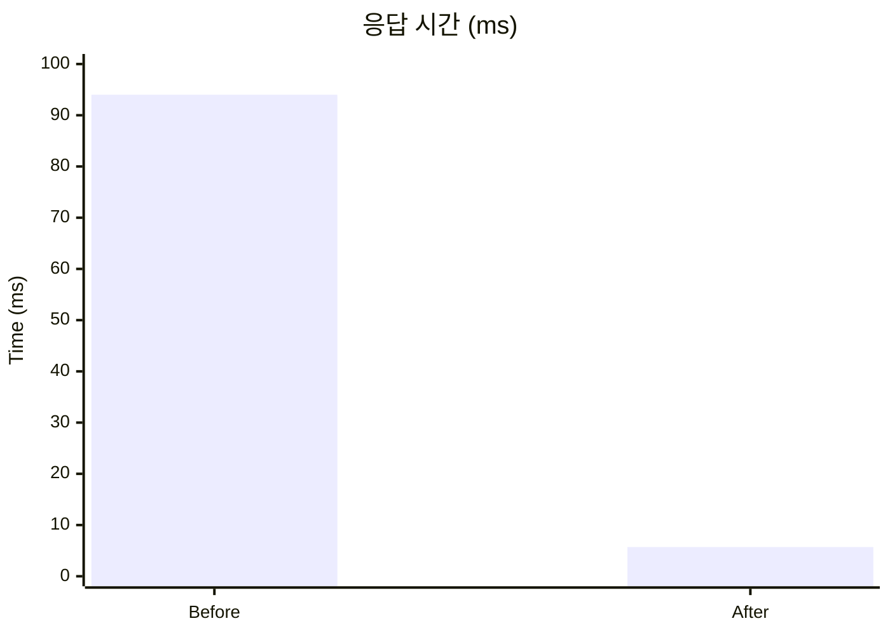

| ⏱️ Before |   ⚡ After    | 🔑 핵심 변경 |
|:---------:|:------------:|------------------------------------------------------------------------------------------------------|
|  `94ms`  | **`5.7ms`** | 부분 재정렬 구조 적용 — 전체 순서를 모두 재정렬하던 방식에서 이동 구간만 update 하도록 개선하여 update 쿼리 범위 최소화 및 p95 기준 93.9% 성능 개선 |

<br>

#### 💬 트랙 댓글 목록 조회 — 🔥 **`25×`** 단축

> local scale 13,687건 트랙 기준 · 복합 인덱스로 `Using filesort` 제거

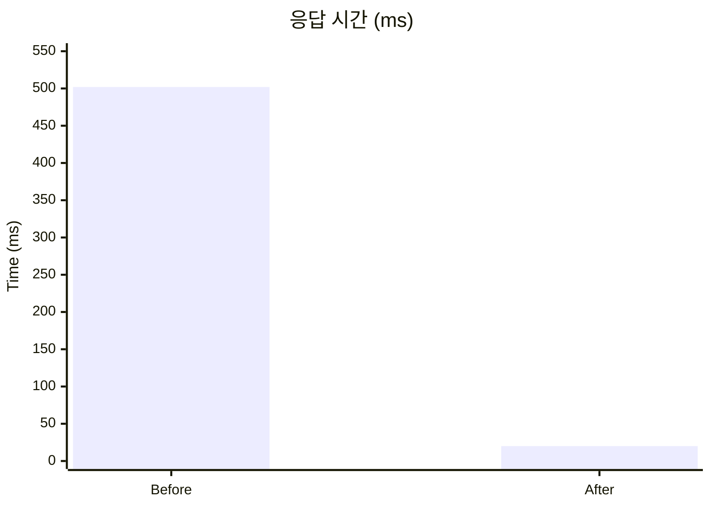

| ⏱️ Before |   ⚡ After    | 🔑 핵심 변경                                                                                                                |
|:---------:|:------------:|-------------------------------------------------------------------------------------------------------------------------|
|  `502ms`  | **`19.5ms`** | **`(track_id, deleted_at, created_at DESC)`** 복합 인덱스 — content 쿼리 `Using index condition` + count 쿼리 `Using index` 로 처리 |

<br>

#### 🎵 공개 트랙 목록 조회 — Page → Slice 전환

> tracks 1,000,000건 기준 · count query 병목 제거

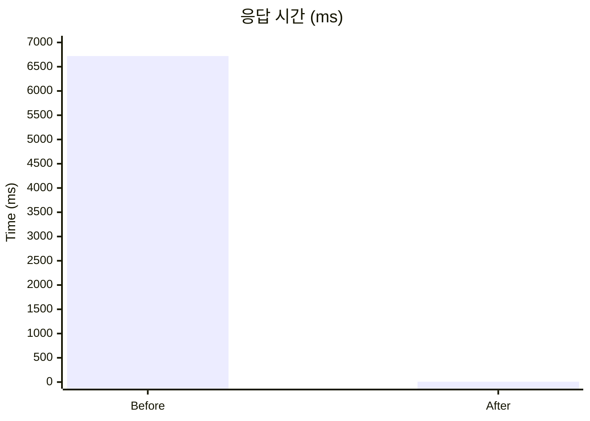

| Before |       After | 핵심 변경 |
|---:|------------:|---|
| `6.72s` | **`7~8ms`** | Page → Slice 전환으로 count query 제거 |

<br>

#### 🔔 PUBLISH_TRACK 대량 알림 — 🔥 **`10×`** 단축

> 10만 팔로워 대상 발매 알림 · RabbitMQ 청크 fan-out + JDBC 옵션 한 줄

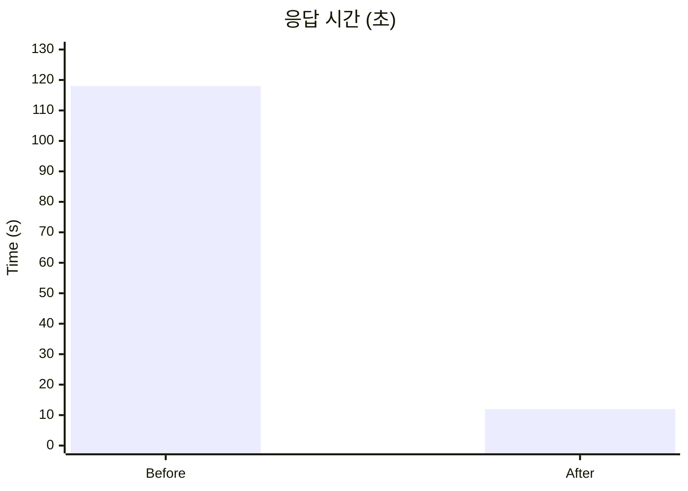

| ⏱️ Before | ⚡ After | 🔑 핵심 변경 |
|:---:|:---:|---|
| `118초` | **`12초`** | **`rewriteBatchedStatements=true`** MySQL JDBC 옵션 활성화 — `JdbcTemplate.batchUpdate` 가 명목상 batch 였던 함정 해소 (청크 처리 시간 6.7배 단축) |

<br>

#### 🧠 트랙 임베딩 배치 — 🔥 **`69×`** 단축

> 1,000곡 임베딩 배치 · `source_hash` 멱등성 + N+1 해소

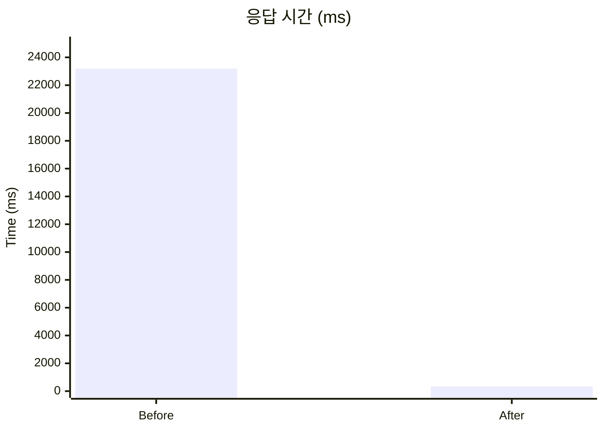

| ⏱️ Before  |   ⚡ After   | 🔑 핵심 변경                                                                                             |
|:----------:|:-----------:|------------------------------------------------------------------------------------------------------|
| `23,190ms` | **`336ms`** | **`source_hash`** SHA-256 멱등성으로 외부 Ollama 호출 99% 감소 + IN 절 일괄 조회로 Hash 조회 N+1 해소 (SELECT 1,000 → 10) |

---

### 🛡️ 데이터 무결성 · 동시성

#### 🎧 Playlist Soft Delete

| 문제                                                | 해결                                                                            |
|---------------------------------------------------|-------------------------------------------------------------------------------|
| `deletedAt` 만으로 soft delete 시 동일 제목 재생성 unique 충돌 | **`deleted` 컬럼 분리** + `(user_id, title, deleted)` 복합 unique — 활성 데이터끼리만 중복 금지 |

---

#### 🛡️ Application 다층 방어선

| 문제                                                | 해결                                                                            |
|---------------------------------------------------|-------------------------------------------------------------------------------|
| Application 동시 승인 시 엔티티 중복 생성 위험                  | **`PESSIMISTIC_WRITE`** 승인/거절 경로에만 `findByIdForUpdate`                        |
| Application 생성 시 TOCTOU (CodeRabbit 지적)           | **Generated Column + UNIQUE** + `saveAndFlush` 로 즉시 unique 충돌 감지              |
| 승인 결과 엔티티 중복 생성 가능성                               | **`application_id` UNIQUE** 최종 방어선                                            |

> [!IMPORTANT]
>
> **검증** : 동시 10건 요청 → **1건 201** / **9건 409** / DB row **1건** / 500 응답 **0건**

---

### ⚡ 캐시 · 검색 · 인덱스

| 문제                                        | 해결                                                                       |
|-------------------------------------------|--------------------------------------------------------------------------|
| `containsIgnoreCase` → `LIKE '%키워드%'` 풀스캔 | **MySQL ngram FULLTEXT (2-gram)** — `홍길동 → "홍길"/"길동"` B-Tree 적중          |
| 트랙 상세 캐시 hit 시 정식 발매 공개 검증 우회             | **정책 검증을 캐시보다 앞으로** — loader 에는 데이터 구성 책임만                               |
| Redis 장애가 트랙 상세 API 실패로 전파                | **모든 캐시 실패를 cache miss 폴백** (Redis get/역직렬화/set/delete 실패 모두 처리)         |
| 댓글 목록 502ms 응답 (filesort)                 | **`(track_id, deleted_at, created_at DESC)` 복합 인덱스** — Using filesort 제거 |
| 인덱스 추가가 오히려 응답 악화 (관리자 신청 목록 690ms)       | **인덱스 미채택** — EXPLAIN 개선 ≠ 응답속도 개선                                       |
| 운영 환경 인덱스 마이그레이션 락 위험                     | **`ALGORITHM=INPLACE, LOCK=NONE`** + PR 본문에 롤백 SQL 명시                    |

> [!TIP]
>
> **성능 개선** : 트랙 댓글 목록 **`502ms → 19.5ms (약 25배 단축)`**

---

### 🔔 알림 시스템

| 문제                                                              | 해결                                                                                                              |
|-----------------------------------------------------------------|-----------------------------------------------------------------------------------------------------------------|
| `@Async` 메모리 큐로 인한 알림 유실 (서버 재시작 / 스레드풀 포화 / 리스너 예외)            | **Outbox 패턴 도입** — 비즈니스 트랜잭션과 같은 트랜잭션으로 PENDING 영속화, ShedLock + REQUIRES_NEW + 1분 후 retry / 최대 3회               |
| 10만 팔로워 대상 발매 알림 단일 워커로 ≈17분 예상                                 | **RabbitMQ 청크 fan-out** — 청크 단위 다중 Consumer 병렬 처리 (Direct Exchange + DLQ + Retry Queue)                         |
| `JdbcTemplate.batchUpdate` 가 명목상 batch 였던 함정 (단건 INSERT 1,000번) | **`rewriteBatchedStatements=true`** MySQL JDBC 옵션 활성화 — 단일 round-trip multi-value INSERT 로 청크 처리 시간 **6.7배 단축** |
| Page 기반 페이지네이션의 불필요한 count 쿼리                                   | **Slice 기반 전환** — `LIMIT + 1` 전략                                                                                |

> [!TIP]
>
> **성능 개선** : 10만 팔로워 알림 **`118초 → 12초 (약 10배 단축)`**

---

### 🧠 임베딩 배치

| 문제                                                    | 해결                                                                                                            |
|-------------------------------------------------------|---------------------------------------------------------------------------------------------------------------|
| 매일 새벽 100% 트랙 Ollama 재호출 (일 변경률 1% 미만)                | **`source_hash`** **SHA-256 멱등성** — 동일 hash 면 외부 호출 스킵                                                        |
| Hash 조회 N+1 (청크 100건 마다 SELECT 100회)                  | **IN 절 일괄 조회** — `findHashesByTrackIds` (SELECT 100 → 1)                                                      |
| UPSERT 안전장치 부재                                        | `WHERE source_hash <> EXCLUDED.source_hash` DB 레벨 이중 필터                                                       |
| 외부 API 호출이 `@Transactional` 내부에 있어 HikariCP 풀 100% 점유 | **Service ↔ PersistService 빈 분리** — `@Transactional` self-invocation 함정 회피, "외부 호출은 트랜잭션 밖, DB 작업만 트랜잭션 안" 원칙 |

> [!TIP]
>
> **성능 개선** : 1,000곡 임베딩 배치 **`23,190ms → 336ms (약 69배 단축)`**

---

### 🔐 인증 · 회원

| 문제                                     | 해결                                                             |
|----------------------------------------|----------------------------------------------------------------|
| Session 의 수평 확장 한계 vs JWT 의 즉시 무효화 어려움 | **JWT 이중 토큰** (Access 30분 / Refresh 7일) — Stateless + 짧은 만료 보완 |
| 회원 탈퇴 시 개인정보 보호 ↔ 서비스 데이터 보존 균형        | **Soft delete + 30일 후 익명화 2단계** — 재생 기록·댓글 은 익명 상태로 유지         |
| 토큰 탈취 시 계정 탈퇴 공격 가능성                   | **탈퇴 시 비밀번호 BCrypt 재확인**                                       |

---

<div style="text-align: center;">

### Made with 5️⃣ by **Fivefy** Team

<sub>곽현민 · 나은총 · 유지현 · 방효경 · 이준석</sub>

</div>
